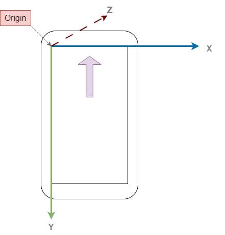

# flutter_animation_practice

### Flutter project animation

#### For flutter
- Origin is on the top left corner.
- x-axis is towards the right of the origin along the top edge of the screen.
- y-axis is in the downward dir. of the origin along the left edge of the screen.
- z-axis perpendicular to the screen and towards inside.



- In flutter positive angle is measured in clockwise direction.
- because the canvas is fliped along x-axis at mid screen.
- Angles are measured in radians. 

#### AnimationController & Animation

`AnimationController` is an object that allows you to control the changes to a double value usually between [0.0, 1.0]. It controls the rate of change which is controlled by setting Duration. Eg: 0.0 -> 1.0 in duration of 1 seconds.

`Animation` is an object tied to `AnimationController`, which changes itself and its values based on the `AnimationController`.

##### Creating `AnimationController` object
```dart
class Home extends StatefulWidget { ... }

class _HomeState extends State<Home> with SingleTickerProviderStateMixin{
  late AnimationController _animationController;

  @override
  void initState() {
    super.initState();
    _animationController = AnimationController(
      vsync: this,
      duration: const Duration(seconds: 3)
    );
  }

  @override
  Widget build(BuildContext context) { ... }

    @override
  void dispose() {
    _animationController.dispose();
    super.dispose();
  }
}
```

Here,
- `duration` -> is the duration in which the `AnimationController` will go from 0f -> 1f.
- `vsync` -> is the object which tells animation controller about the widget/component it can sync itself with while drawing the component. Basically sync with its referesh rate. Which is provided by our Home widget here which uses `SingleTickerProviderStateMixin`.
- And we dispose of our `AnimationController`.

##### Creating `Animation` object

```dart
class Home extends StatefulWidget { ... }

class _HomeState extends State<Home> with SingleTickerProviderStateMixin{
  
  late AnimationController _animationController;
  late Animation<double> _animation;  // <---

  @override
  void initState() {
    super.initState();
    _animationController = AnimationController( ... );

    _animation = Tween<double>(begin: 0.0, end: 2 * pi)
                    .animate(_animationController); // <---
  }

  @override
  Widget build(BuildContext context) { ... }
}
```

Here, 
- Animation is using a simple `Tween` animation which goes bet**Tween** the `begin` and `end` values.
- And it is tied to the `AnimationController` object.
- Animation is of `double` type since we changing a double value.


### Transform Widget

- Transform widget is used to geometrically transform is child widget in the co-ordinate system.
```dart
Transform(
    alignment: Alignment.center,
    // origin: Offset(0, 50), // use when a precise point is needed
    transform: Matrix4.identity()..rotateZ(pi/4),
    child: Container( ... ),
)
```

Here,
- `alignment` -> positions the pivot on the child
- `origin` -> can be used for a more precise placement of the pivot
- `transform` takes a matirx transform value. This is where we perform our transformations.


### AnimatedBuilder

Just simply providing the `_animation.value` to the matrix transform will not actually do anything. Ex:

```dart
@override
Widget build(BuildContext context) {

  return Scaffold(
    body: Center(
      child: Transform(
        alignment: Alignment.center,
        transform: Matrix4.identity()..rotateZ(_animation.value), // <---
        child: Container(...),
      ),
    ),
  );
}
```
This won't work since the screen is not being refreshed/rebuilt. To do the we need a `AnimatedBuilder` which is a `Listenable` and listens to the `AnimatedController` object and rebuilds the Widget when the value of `AnimatedController` object changes. And we wrap the element which uses the `Animation` values with the `AnimatedBuilder`.

```dart

@override
Widget build(BuildContext context) {

  return Scaffold(
    body: Center(
      child: AnimatedBuilder(
        animation: _animationController,
        builder: (context, child) {
          return Transform(
            alignment: Alignment.center,
            transform: Matrix4.identity()..rotateY(_animation.value),
            child: Container(...),
          );
        },
      ),
    ),
  );
}
```


Here,
- `animation` -> takes the `AnimatedController` object.
- `builder` -> returns the Widget that is to be rebuilt using the animation values.
